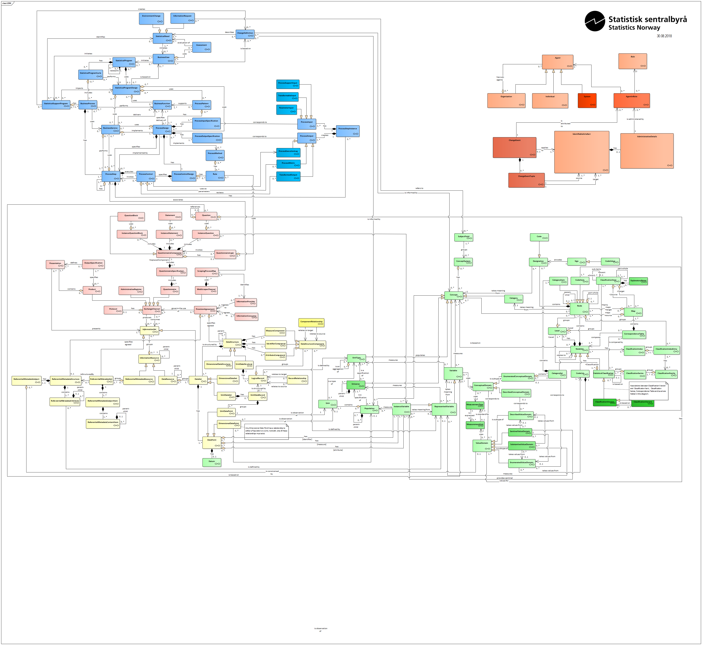

# gsim-raml-schema
Statistics Norway is modernizing its core systems for statistical production. Statistics Norway implements a logical data model based on the UN standard [Generic Statistical Information Model (GSIM)](https://statswiki.unece.org/display/gsim/Generic+Statistical+Information+Model).

This project is documentation of the physical design using [RAML](https://raml.org/) (RESTful API Modeling Language).

The intention is to have all GSIM objects and attributes represented as RAML-files.

Image of the logical data model (LDM):

<a href="ssb_gsim_ldm.png"></a>


## RAML
The raml-files in this project follows the RAML 1.0 spesification.

We only use the `data types` section of RAML. There are no endpoints or methods. Those are automatically generated using [Linked Data Store ](https://github.com/statisticsnorway/linked-data-store-documentation).


### Inheritance
Objects that are abstract in GSIM is maintained in the folder `/schemas/abstract/`.

A typical example of this is the object IdentifiableArtefact that is reused in almost all other objects:

```RAML
#%RAML 1.0 Library
uses:
  IdentifiableArtefact: ./abstract/IdentifiableArtefact.raml

types:
  DataStructure:
    description:  Defines the structure of an organized collection of data (Data Set).
    type: [ IdentifiableArtefact.IdentifiableArtefact ]
```

### Annotations
This is maintained in the folder `/schemas/annotation/`

Attributes can link to other objects, and this is done by using annotations.

```Link
#%RAML 1.0 Library
#Defines links between attributes and objects
annotationTypes:
  types:
    type: string[]
    description: Holds the type of objects a link points to
```


## Linked Domain

* By using annotation `(Link.types)` a link can be defined as a property of an attribute.
* The cardinality of a link is controlled by both the `type` property of the attribute and if the attribute is optional or mandatory.
* A single link should be defined as type `string`.
* A multiple link should be defined as type `string[]`.
* The value of the link holds the legal domains for this link.


```RAML
#%RAML 1.0 Library
uses:
  Link: ./annotation/Link.raml
  IdentifiableArtefact: ./abstract/IdentifiableArtefact.raml

types:
  DataStructure:
    description:  Defines the structure of an organized collection of data (Data Set).
    type: [ IdentifiableArtefact.IdentifiableArtefact ]

    properties:
      id:
        type: string
        description: The global unique identifier (GUID) of the information object assigned by the owner agency.

      mandatoryComponents:
        type: string[]
        description: One or more Identifier- or MeasureComponents
        (Link.types): [IdentifierComponent, MeasureComponent]

      optionalComponents?:
        type: string[]
        description: One or more AttributeComponents to describe something about the measures in a dataset.
        (Link.types): [AttributeComponent]

```

### Example of linked domain
Consider the following json-example. It shows that a DataStructure has a list of links
to both IdentifierComponent and MeasureComponent through the `mandatoryComponents` property.
* Links are string typed fields that carry the relative resource path with the managed domain
  and ID of the entity they link to.

```json
{
  "id": "b68daffc-6dbe-467a-8670-02c927ff73e7",
  "mandatoryComponents": [
    "/IdentifierComponent/2af2368c-3ab1-44df-860e-bd60d30f8f96",
    "/IdentifierComponent/1e91eb73-da0c-4ee5-8fdd-81a948048e44",
    "/MeasureComponent/2499638d-5f58-463c-8310-772fbd3d78ad"
  ],
  "optionalComponents": [
    "/AttributeComponent/0716427a-add2-4327-bfb0-e91659bb6f9a"
  ]
}  
```


# Implementation roadmap

This is an overview of the implementation progress.

## Per GSIM Group

Group|Coverage|Progress|Comment
---|---|---|---
Base|||
Exchange||| We have made a conscious choice not to focus on the `Questionnaire` objects at this point.   
Concepts||| We have made a conscious choice not to focus on the some of the objects related to codelists and classifications since they are covered in an existing system (KLASS) used by Statistic Norway. See additional notes at the bottom of this document.
Structures||| We have made a conscious choice not to focus on the `Reference Metatdata` objects at this point.   
Business||| All objects are covered, but there has been little time to go through the quality of attributes and usable examples.

Explanation:
* Coverage means how many GSIM-objects exists as RAML-files.
* Progress indicates the quality of those RAML-files (including associated JSON example files).

## Per GSIM Object

### Legend
Progress range|This means
---|---
 - | Develop on this object has begun in a separate branch, but it is not merged into master branch yet.
- | The object is merged into master branch, but must still be considered an early draft.
 - | The object is merged into master branch, and is considered more than a draft.


Objects in master-branch is found here: https://github.com/statisticsnorway/gsim-raml-schema/tree/master/schemas

### Progress
[done]: http://progressed.io/bar/100?title=done "Done"
[todo]: http://progressed.io/bar/0 "Done"

GSIM Group|Object|Progress|Comment
---|---|---|---
Base|Identifiable Artefact||Abstract Object
Base|Administrative Details||Object Type
Base|Multilingual Text||Object Type
Base|Agent||
Base|AgentDetails||Abstract Object
Base|Agent In Role||
Base|Role||
Base|Organization|| Implemented as `ENUM` in `Agent.agentType`
Base|Individual|| Implemented as `ENUM` in `Agent.agentType`
Base|System|| Implemented as `ENUM` in `Agent.agentType`
Exchange|Exchange Channel||Abstract Object
Exchange|Protocol||
Exchange|Provision Agreement||
Exchange|Information Provider||
Exchange|Data Harvester||Renamed from `Web Scraper Channel`
Exchange|Questionnaire||
Exchange|Adminstrative Register||
Exchange|Product||
Exchange|OutputSpecification||
Exchange|Presentation||
Concepts|Variable||
Concepts|Represented Variable||
Concepts|Value Domain||Abstract Object
Concepts|Population||
Concepts|Unit Type||
Concepts|Instance Variable||
Concepts|Described Value Domain||
Concepts|Enumerated Value Domain||
Concepts|Sentinel Value Domain|| Implemented as attribute in `Instance Variable` with link to either `Enumerated Value Domain` or `Described Value Domain`
Concepts|Substantive Value Domain|| Implemented as attribute in `Represented Variable` with link to either `Enumerated Value Domain` or `Described Value Domain`Concepts|SubjectField||
Concepts|Universe||
Concepts|MeasurementType||
Concepts|MeasurementUnit||
Concepts|Concept||Abstract Object
Structures|Component Relationship||
Structures|Data Structure Component||Abstract Object
Structures|Identifier Component||
Structures|Measure Component||
Structures|Attribute Component||
Structures|Data Structure|| Abstract Object
Structures|Unit Data Structure||
Structures|Dimensional Data Structure||
Structures|Data Set|| Abstract Object
Structures|Unit Data Set||
Structures|Dimensional Data Set||
Structures|Information Resource|| Abstract Object
Structures|Data Resource||
Structures|Logical Record||
Structures|Record Relationship||
Structures|Statistical Register Persons|| Implemented as `ENUM` in `DataResource.dataResourceType`
Structures|Establishment Enterprise Register|| Implemented as `ENUM` in `DataResource.dataResourceType`
Business|Assessment||
Business|BusinessCase||
Business|BusinessFunction||
Business|BusinessProcess||
Business|BusinessService||
Business|ChangeDefinition||
Business|EnvironmentChange||
Business|InformationRequest||
Business|ParameterInput||
Business|ProcessControl||
Business|ProcessControlDesign||
Business|ProcessDesign||
Business|ProcessExecutionLog||
Business|ProcessInput||  Abstract Object
Business|ProcessInputSpesification||
Business|ProcessMethod||
Business|ProcessMetric||
Business|ProcessOutput|| Abstract Object
Business|ProcessOutputSpesification||
Business|ProcessPattern||
Business|ProcessStep||
Business|ProcessStepInstance||
Business|ProcessSupportInput||
Business|Rule||
Business|StatisticalNeed|| Abstract Object
Business|StatisticalSupportProgram||
Business|StatisticalProgram||
Business|StatisticalProgramCycle||
Business|StatisticalProgramDesign||
Business|TransformableInput||
Business|TransformedOutput||


# Regarding Statistical Classifications and Codelists

Objects in Concepts group regarding classifications and codelists has not yet been addressed in RAML due to the use of an existing system for this in Statistics Norway  (https://www.ssb.no/en/klass/).

In `EnumeratedVariableDomain` there is an attribute that links to this system:
```KlassUrl
#%RAML 1.0 Library
uses:
  IdentifiableArtefact: ./abstract/IdentifiableArtefact.raml
  ValueDomain: ./abstract/ValueDomain.raml

types:
  EnumeratedValueDomain:
    description: A Value Domain expressed as a list of Categories and associated Codes.
    type: [IdentifiableArtefact.IdentifiableArtefact, ValueDomain.ValueDomain]

    properties:
      klassUrl:
        type: string
        description: The url to KLASS (Statistics Norways system for Classifications and Codelists).
        displayName: Klass Url

```

Example:

```Eksempel
{
    "id": "bf51c92c-d3d2-4190-bdf1-df4332ca14cc",
    "name": [
      {
        "languageCode": "en",
        "languageText": "Families 2006"
      }
    ],
    "description": [
      {
        "languageCode": "en",
        "languageText": "Classification of families"
      }
    ],
    "administrativeStatus": "OPEN",
    "version": "1.0.0",
    "versionValidFrom": "2006-01-01T00:00:00.000Z",
    "validFrom": "2006-01-01T00:00:00.000Z",
    "createdDate": "2006-01-01T00:00:00.000Z",
    "createdBy": "OHV",
    "dataType": "STRING",
    "klassUrl": "https://www.ssb.no/en/klass/klassifikasjoner/17"
}

```

## Future expansions
KLASS (Statistics Norways system for classifications and Codelists) is also based on GSIM, and will hopefully in the future be a part of the RAML spesifications of this project.

See KLASS on Github: https://github.com/statisticsnorway/klass
